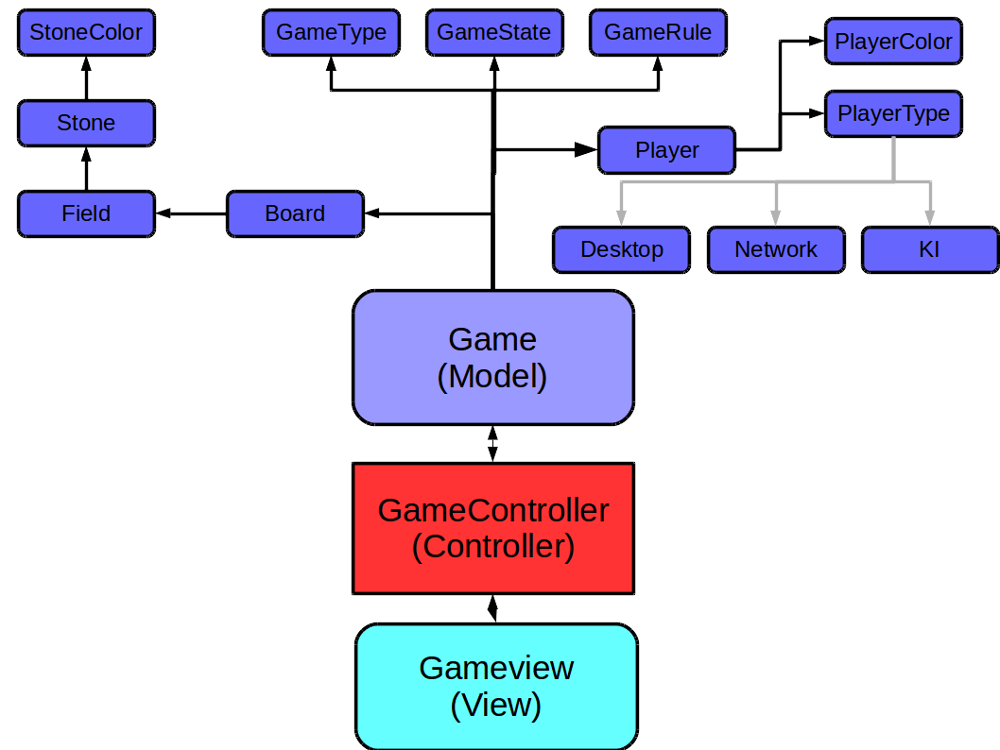

# HoboOthello

HoboOthello by Laura, Steffen and Björn. A Othello/Reversi Game.
A special shout out goes to Rudi for his headaches while double checking crappy HoboCode.
Part credit for the resizable game board goes out to ByMiles for the classy reminder that in fact there is a
ComponentListener in Java Swing. When playing, dont forget to Go Hobo!

And never forget to STAY HOBO!!

_____________________
Game Rules

## Doc
http://hoboothello.readthedocs.io/en/latest/

